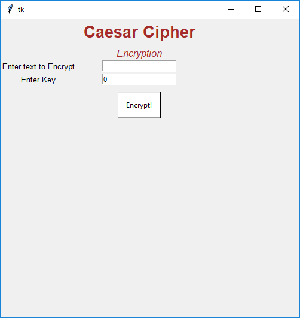
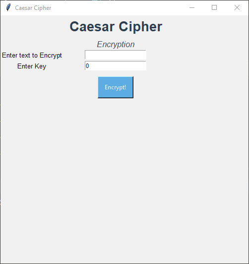
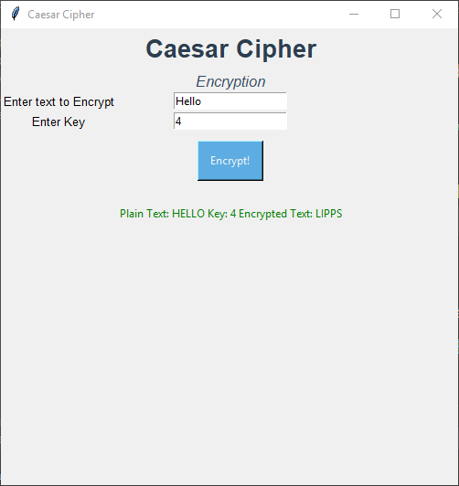
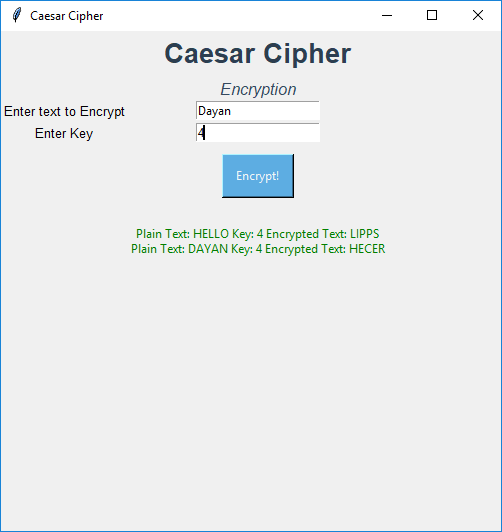
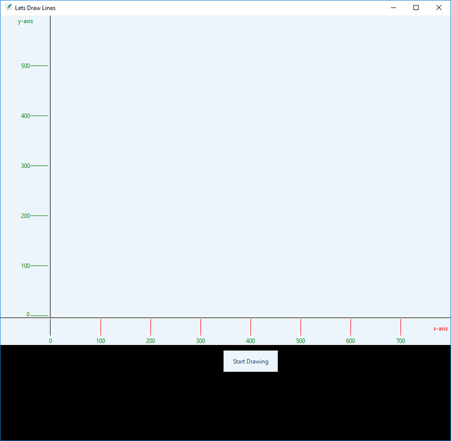

# Tkinter-GUI Based Initial Practise Projects

### Ceaser Cipher

 using my own technique

     <h4>Edited</h4>

Here, I hvae used a Key 4. In caesar cipher.py you can takes the value from 1 - 26

   

### Resturant Feedback

Using Filling(which saves data) and Messsage Box

### Line Drawer

Line Drawer <b>(Under Construction)</b>

# Tkinter-GUI Practice Code

My initial practice code of TKINTER GUI 
1- Welcome = Label  
2- Image = Declaring Images 
3- Attribiutes of Labels 
    such as 
    
    # Important Label Options
    # text - add the text
    # bd - background
    # fg - foreground
    # font - set the font
    # 1. font=("comicsansms", 19, "bold")
    # 2. font=("comicsansms 19 bold")
    # padx - x padding
    # pady - y padding
    # relief - border styling - SUNKEN, RAISED, GROOVE, RIDGE
    # and
    # Important Pack Options
    # anchor = nw, ne, se, sw (NorthEast, SouthEast....)
    # side = top, bottom, left, right
    # fill - fill=X,Y
    # padx
    # pady
    
4- Newspaper using Attribiutes  
5- Frames 
6- Button  

    # We can decalre fucntion in button using "commannd = function_name "
7- Grids  
8- CheckBox Buttons along with csv file  

 
9- Canvas GUI  

 
10- Mouse Event Handling 
    
     # bind is the keyword used to bind the mouse events
     # <Button-1> = Left Mouse Button
     # <Button-1> = Left Mouse Button
     # <Button-2> = Middle Mouse Button
     # <Button-3> = Right Mouse Button
     # Double is used for double click   

11- Exercise: Newspaper 

 
12- Ceaser Cipher using filling. 

         <h2>Edited</h2>
    
Here, I hvae used a Key 4. In caesar cipher.py you can takes the value from 1 - 26

    
13- Menus 
    
    # Non-Drop Down
    menu = Menu(root)
    menu.add_command(label="File", command=my_function)
    menu.add_command(label="Quit", command=quit)
    root.config(menu=menu)

    # Drop Down
    main_menu = Menu(root)
    # tearoff use to fix the menu
    sub_menu1 = Menu(main_menu, tearoff=0)
    sub_menu1.add_command(label="New", command=my_function)
    # for seprating in menus
    sub_menu1.add_separator()
    sub_menu1.add_command(label="Quit", command=quit)
    root.config(menu=main_menu)
    main_menu.add_cascade(label="File", menu=sub_menu1)
    
14- Mesage Box 
    
    # important tags 
    # import tkinter.messagebox as tmsg
    # tmsg.askquestion("Label", "Message")
    # tmsg.showinfo("Label", "Message")
    # tmsg.askretrycancel("Label", "Message")
    # tmsg.showwarning("Label", "Message")
    
15- Scale Slider

    # important attributes are
    # Scale
    # oreint = HORIZONTAL By Default it is Vertical
    # tkinterval = (set the value which divide it)
    # scale.set(5)<- set the default value By Default it is 0

16- GUI with Classes
17- Scrollbar
18- Statusbar

    #statusvar = StringVar()
    #statusvar.set("Ready")

    #sbar = Label(root, textvariable=statusvar, relief=SUNKEN, anchor="w")
    #sbar.pack(side=BOTTOM, fill=X)

19- Listbox
    
    # lbx = Listbox(root)
    # lbx.pack()  
    #lbx.insert(END, "First item of List")

20- Menus

    # main_menu = Menu(root)
    #sub_menu1 = Menu(main_menu, tearoff=0)
    #sub_menu1.add_command(label="New", command=my_function)
    #sub_menu1.add_separator()
    #sub_menu1.add_command(label="Quit", command=quit)
    #root.config(menu=main_menu)
    #main_menu.add_cascade(label="File", menu=sub_menu1)

    #sub_menu2 = Menu(main_menu, tearoff=0)
    #sub_menu2.add_command(label="Test1", command=my_function)
    #sub_menu2.add_separator()
    #sub_menu2.add_command(label="Quit", command=quit)
    #root.config(menu=main_menu)
    #main_menu.add_cascade(label="Test", menu=sub_menu2)

